# Quantis-Stock — Modèle Conceptuel de Données (MCD)

> **Version :** 1.0 — **Date :** 2026-08-01 — **Devise :** FCFA — **TVA :** 18% (Burkina Faso)

---

## 1. Diagramme Entités-Relations

```mermaid
erDiagram
    Utilisateur {
        bigint id PK
        varchar nom
        varchar prenom
        varchar email UK
        varchar mot_de_passe_hash
        enum role "ADMIN|GERANT|MAGASINIER|CAISSIER|COMPTABLE"
        bigint depot_id FK
        boolean actif
        timestamp created_at
        timestamp updated_at
    }

    Depot {
        bigint id PK
        varchar nom
        varchar adresse
        varchar telephone
        boolean est_actif
        timestamp created_at
    }

    Categorie {
        bigint id PK
        varchar nom
        text description
        bigint parent_id FK "auto-référence (hiérarchie)"
        timestamp created_at
    }

    UniteMesure {
        bigint id PK
        varchar nom "ex: Kilogramme, Litre, Pièce"
        varchar abreviation "ex: kg, L, pcs"
    }

    Produit {
        bigint id PK
        varchar sku UK
        varchar code_barres UK
        varchar nom
        text description
        bigint categorie_id FK
        bigint unite_id FK
        decimal prix_achat "FCFA"
        decimal prix_vente "FCFA"
        decimal taux_tva "défaut 18"
        integer seuil_alerte "défaut 10"
        boolean actif
        varchar image_url
        timestamp created_at
        timestamp updated_at
    }

    VarianteProduit {
        bigint id PK
        bigint produit_id FK
        varchar attribut "ex: Taille, Couleur, Poids"
        varchar valeur "ex: XL, Rouge, 500g"
        varchar sku_variante UK
        varchar code_barres_variante
        decimal prix_achat_override "nullable, sinon hérité"
        decimal prix_vente_override "nullable, sinon hérité"
        boolean actif
    }

    StockCourant {
        bigint id PK
        bigint produit_id FK
        bigint variante_id FK "nullable"
        bigint depot_id FK
        decimal quantite
        timestamp derniere_maj
    }

    MouvementStock {
        bigint id PK
        uuid uuid_sync UK "pour idempotence sync"
        bigint produit_id FK
        bigint variante_id FK "nullable"
        bigint depot_source_id FK "nullable"
        bigint depot_dest_id FK "nullable"
        enum type "ENTREE|SORTIE|TRANSFERT|AJUSTEMENT"
        enum motif "ACHAT|VENTE|TRANSFERT|RETOUR|CASSE|PERTE|INVENTAIRE|AUTRE"
        decimal quantite
        varchar reference "ex: CMD-2026-00012"
        text commentaire
        bigint utilisateur_id FK
        timestamp created_at
    }

    Client {
        bigint id PK
        varchar nom
        varchar telephone
        varchar email
        text adresse
        decimal solde_credit "FCFA, créances"
        text notes
        boolean actif
        timestamp created_at
        timestamp updated_at
    }

    Fournisseur {
        bigint id PK
        varchar nom
        varchar telephone
        varchar email
        text adresse
        decimal solde_dette "FCFA"
        text notes
        boolean actif
        timestamp created_at
        timestamp updated_at
    }

    CommandeFournisseur {
        bigint id PK
        varchar numero UK "CMD-YYYY-NNNNN"
        bigint fournisseur_id FK
        bigint depot_id FK
        enum statut "BROUILLON|ENVOYEE|PARTIELLE|LIVREE|ANNULEE"
        decimal total_ht "FCFA"
        decimal total_ttc "FCFA"
        date date_commande
        date date_livraison_prevue
        text notes
        bigint utilisateur_id FK
        timestamp created_at
        timestamp updated_at
    }

    LigneCommandeFournisseur {
        bigint id PK
        bigint commande_id FK
        bigint produit_id FK
        bigint variante_id FK "nullable"
        decimal quantite_commandee
        decimal quantite_recue
        decimal prix_unitaire "FCFA"
        decimal montant_ht "FCFA"
    }

    Document {
        bigint id PK
        uuid uuid_sync UK
        enum type "DEVIS|BON_LIVRAISON|FACTURE|AVOIR"
        varchar numero UK "FAC-YYYY-NNNNN"
        bigint client_id FK
        bigint depot_id FK
        enum statut "BROUILLON|VALIDE|ANNULE"
        decimal total_ht "FCFA"
        decimal total_tva "FCFA"
        decimal total_ttc "FCFA"
        date date_document
        date date_echeance
        text notes
        bigint document_parent_id FK "self-ref: devis→BL→facture"
        bigint utilisateur_id FK
        timestamp created_at
        timestamp updated_at
    }

    LigneDocument {
        bigint id PK
        bigint document_id FK
        bigint produit_id FK
        bigint variante_id FK "nullable"
        varchar designation
        decimal quantite
        decimal prix_unitaire "FCFA"
        decimal taux_tva
        decimal montant_ht "FCFA"
        decimal montant_tva "FCFA"
        decimal montant_ttc "FCFA"
    }

    Paiement {
        bigint id PK
        uuid uuid_sync UK
        bigint document_id FK
        decimal montant "FCFA"
        enum moyen "ESPECES|MOBILE_MONEY|VIREMENT|CHEQUE"
        date date_paiement
        varchar reference
        bigint utilisateur_id FK
        timestamp created_at
    }

    JournalCaisse {
        bigint id PK
        enum type "ENTREE|SORTIE"
        decimal montant "FCFA"
        varchar libelle
        bigint document_id FK "nullable"
        bigint depot_id FK
        bigint utilisateur_id FK
        date date_operation
        timestamp created_at
    }

    AuditLog {
        bigint id PK
        bigint utilisateur_id FK
        varchar action "CREATE|UPDATE|DELETE|LOGIN|LOGOUT"
        varchar entite "Produit|Document|MouvementStock|..."
        bigint entite_id
        jsonb details
        varchar ip_address
        timestamp created_at
    }

    Configuration {
        bigint id PK
        varchar cle UK "ex: tva_defaut, prefixe_facture"
        varchar valeur
        text description
    }

    Utilisateur }o--|| Depot : "rattaché à"
    Categorie }o--o| Categorie : "sous-catégorie de"
    Produit }o--|| Categorie : "appartient à"
    Produit }o--|| UniteMesure : "mesuré en"
    VarianteProduit }o--|| Produit : "variante de"
    StockCourant }o--|| Produit : "stock de"
    StockCourant }o--o| VarianteProduit : "stock variante"
    StockCourant }o--|| Depot : "dans"
    MouvementStock }o--|| Produit : "concerne"
    MouvementStock }o--o| VarianteProduit : "variante"
    MouvementStock }o--o| Depot : "depuis (source)"
    MouvementStock }o--o| Depot : "vers (dest)"
    MouvementStock }o--|| Utilisateur : "effectué par"
    CommandeFournisseur }o--|| Fournisseur : "commandé à"
    CommandeFournisseur }o--|| Depot : "livré à"
    CommandeFournisseur }o--|| Utilisateur : "créé par"
    LigneCommandeFournisseur }o--|| CommandeFournisseur : "ligne de"
    LigneCommandeFournisseur }o--|| Produit : "produit"
    LigneCommandeFournisseur }o--o| VarianteProduit : "variante"
    Document }o--|| Client : "adressé à"
    Document }o--|| Depot : "depuis"
    Document }o--o| Document : "converti de"
    Document }o--|| Utilisateur : "créé par"
    LigneDocument }o--|| Document : "ligne de"
    LigneDocument }o--|| Produit : "produit"
    LigneDocument }o--o| VarianteProduit : "variante"
    Paiement }o--|| Document : "paie"
    Paiement }o--|| Utilisateur : "enregistré par"
    JournalCaisse }o--o| Document : "lié à"
    JournalCaisse }o--|| Depot : "caisse de"
    JournalCaisse }o--|| Utilisateur : "par"
    AuditLog }o--|| Utilisateur : "action de"
```



---

## 2. Contraintes d'intégrité

| Contrainte | Table | Règle |
|---|---|---|
| UNIQUE | `StockCourant` | `(produit_id, variante_id, depot_id)` — un seul enregistrement par combinaison |
| UNIQUE | `Produit` | `sku` et `code_barres` uniques |
| UNIQUE | `Document` | `numero` unique par type |
| CHECK | `StockCourant` | `quantite >= 0` (sauf override Admin) |
| CHECK | `MouvementStock` | `quantite > 0` |
| CHECK | `Paiement` | `montant > 0` |
| NOT NULL | `MouvementStock` | `depot_source_id` requis si type = SORTIE/TRANSFERT |
| NOT NULL | `MouvementStock` | `depot_dest_id` requis si type = ENTREE/TRANSFERT |
| CASCADE | `LigneDocument` | Suppression en cascade si Document supprimé (brouillon uniquement) |

---

## 3. Index recommandés

```sql
-- Recherche rapide produits
CREATE INDEX idx_produit_sku ON produit(sku);
CREATE INDEX idx_produit_code_barres ON produit(code_barres);
CREATE INDEX idx_produit_nom ON produit(nom);
CREATE INDEX idx_produit_categorie ON produit(categorie_id);

-- Stock par dépôt
CREATE INDEX idx_stock_produit_depot ON stock_courant(produit_id, depot_id);

-- Mouvements par date et produit
CREATE INDEX idx_mouvement_produit ON mouvement_stock(produit_id);
CREATE INDEX idx_mouvement_date ON mouvement_stock(created_at);
CREATE INDEX idx_mouvement_depot_source ON mouvement_stock(depot_source_id);

-- Documents par client et date
CREATE INDEX idx_document_client ON document(client_id);
CREATE INDEX idx_document_numero ON document(numero);
CREATE INDEX idx_document_date ON document(date_document);

-- Sync offline
CREATE INDEX idx_mouvement_uuid ON mouvement_stock(uuid_sync);
CREATE INDEX idx_document_uuid ON document(uuid_sync);
CREATE INDEX idx_paiement_uuid ON paiement(uuid_sync);

-- Audit
CREATE INDEX idx_audit_date ON audit_log(created_at);
CREATE INDEX idx_audit_entite ON audit_log(entite, entite_id);
```

---

## 4. Notes techniques

- **Devise** : Tous les montants en **FCFA** (pas de décimales nécessaires, mais `decimal(15,2)` pour flexibilité).
- **Variantes** : La table `VarianteProduit` est optionnelle. Un produit sans variante fonctionne avec `variante_id = NULL` partout.
- **UUID sync** : Les tables impliquées dans la sync offline portent un `uuid_sync` pour garantir l'idempotence.
- **Soft delete** : `actif = false` sur Utilisateur, Produit, Client, Fournisseur. Jamais de `DELETE` physique.
- **Horodatage** : Tous les `timestamp` en UTC. Conversion locale côté Flutter.
